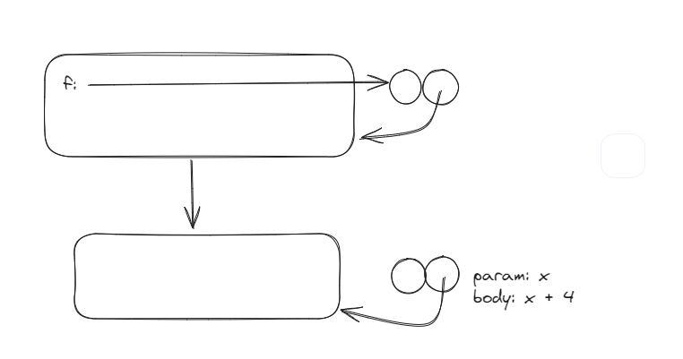

# Functions in the Environment

Given the following snippet

```javascript
function f(g) {
    return g(2);
}

f(x => x + 4);
```

Where does the function closure (or function object) point to?

It's very easy to glance through the code and think: "Well, the lambda function is in the function f, so we pass the entire lambda function into the function". To visualize this **misconception,** this is what you might THINK it looks like:

### Wrong Expansion

```javascript
function f(g) {
    return g(2);
}

f(x => x + 4);

// During evaluation:
// f(x => x + 4) {
//     return (x => x + 4)(2);
// }
```

<figure><figcaption></figcaption></figure>

But this isn't quite right. Our function objects (closures) are not created on **application,** like the above would suggest, but when it is first 'declared'. Think of it like an expression like:

```javascript
f(3 + 4)
```

You wouldn't evaluate the `3+4` inside the f scope, but in the program environment. Similarly with lambda functions, you can think of the code snippet, after expanding the lambda functions as follows:

### Correct Expansion

<pre class="language-javascript"><code class="lang-javascript">function f(g) {
    return g(2);
}

f(x => x + 4);

// Correct Expansion

// function lambda(x) {
<strong>//     return x + 4;
</strong>// }
// f(lambda)
</code></pre>
